# Presupuesto y Seguimiento de Sprints - BossFlow

## Información General

**Equipo:** 3 estudiantes de DAW en Cádiz  
**Tarifa:** 15€/hora (programadores junior)  
**Duración total:** 6 sprints (3 noviembre - 15 diciembre 2025)

---

## Sprint 1: Fundación del Proyecto

**Fechas:** 3 noviembre - 9 noviembre 2025  

### Objetivos del Sprint

- Configuración inicial del proyecto (frontend + backend)
- Documentación técnica completa
- Diseño de base de datos MongoDB
- Setup de infraestructura básica
- Página Home funcional

### Capturas Toggl Track - Sprint 1

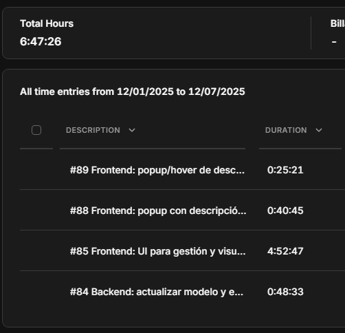

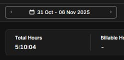

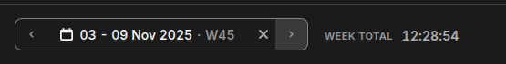

### Coste Total Sprint 1

| Concepto       | Tiempo Estimado | Tiempo Real | Coste Estimado | Coste Real |
| -------------- | --------------- | ----------- | -------------- | ---------- |
| Desarrollo     | 60 horas        | 26 horas    | 900 €          | 390 €      |
| **Diferencia** | -34 horas       |             | -510 €         |

**Análisis:** Sprint completado en 43% del tiempo estimado. El equipo fue más eficiente gracias a conocimientos previos de documentación y configuración básica de proyectos.

---

## Sprint 2: Sistema de Autenticación

**Fechas:** 10 noviembre - 16 noviembre 2025  

### Objetivos del Sprint

- Implementación de registro de usuarios
- Sistema de login con JWT
- Context API para gestión de estado de autenticación
- Protección de rutas privadas
- Navbar con estado de sesión

### Capturas Toggl Track - Sprint 2

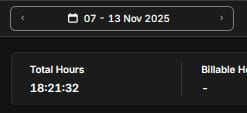

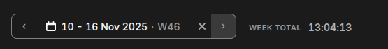

### Coste Total Sprint 2

| Concepto       | Tiempo Estimado | Tiempo Real | Coste Estimado | Coste Real |
| -------------- | --------------- | ----------- | -------------- | ---------- |
| Desarrollo     | 60 horas        | 40 horas    | 900 €          | 600 €      |
| **Diferencia** | -20 horas       |             | -300 €         |

**Análisis:** Sprint completado en 67% del tiempo estimado. El sistema de autenticación fue más complejo de lo previsto inicialmente, especialmente la integración con JWT y la gestión de tokens en el frontend.

---

## Sprint 3: Editor de Diagramas Core

**Fechas:** 17 noviembre - 23 noviembre 2025  

### Objetivos del Sprint

- Integración de React Flow
- Creación y edición de nodos
- Conexiones entre nodos (edges)
- Panel lateral con tipos de nodos
- Guardado de diagramas en BD

### Capturas Toggl Track - Sprint 3

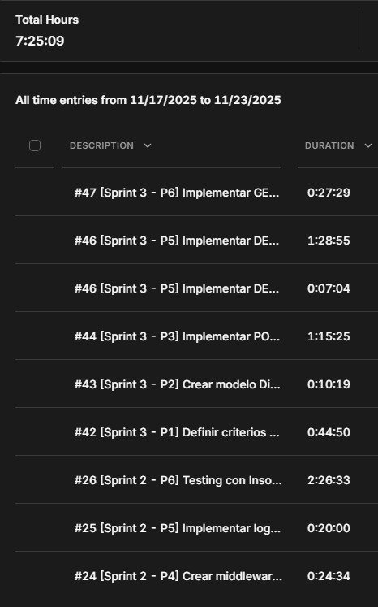

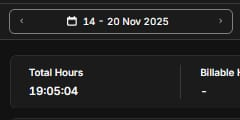

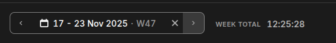

### Coste Total Sprint 3

| Concepto       | Tiempo Estimado | Tiempo Real | Coste Estimado | Coste Real |
| -------------- | --------------- | ----------- | -------------- | ---------- |
| Desarrollo     | 60 horas        | 41 horas    | 900 €          | 615 €      |
| **Diferencia** | -19 horas       |             | -285 €         |

**Análisis:** Sprint completado en 68% del tiempo estimado. React Flow tuvo una curva de aprendizaje pronunciada, especialmente en la personalización de nodos y la gestión del estado del diagrama.

---

## Sprint 4: Gestión de Diagramas

**Fechas:** 24 noviembre - 30 noviembre 2025  

### Objetivos del Sprint

- Dashboard con lista de diagramas
- Búsqueda y filtrado de diagramas
- Integración con API RAWG.io para juegos
- CRUD completo de diagramas
- Sistema de plantillas básicas

### Capturas Toggl Track - Sprint 4

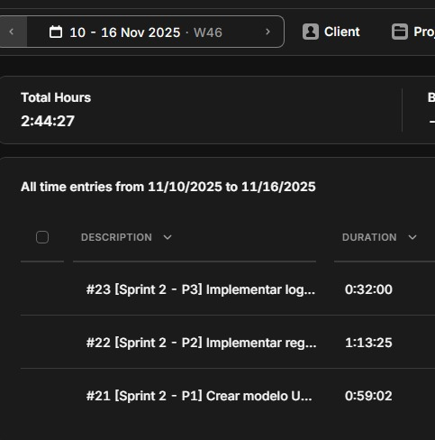

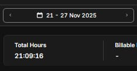

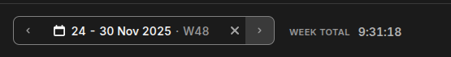

### Coste Total Sprint 4

| Concepto       | Tiempo Estimado | Tiempo Real | Coste Estimado | Coste Real |
| -------------- | --------------- | ----------- | -------------- | ---------- |
| Desarrollo     | 60 horas        | 35 horas    | 900 €          | 525 €      |
| **Diferencia** | -25 horas       |             | -375 €         |

**Análisis:** Sprint completado en 58% del tiempo estimado. La experiencia acumulada en los sprints anteriores permitió completar el CRUD de diagramas más rápidamente. La API RAWG.io fue intuitiva de integrar.

---

## Sprint 5: Funcionalidades Avanzadas

**Fechas:** 1 diciembre - 7 diciembre 2025  

### Objetivos del Sprint

- Exportación de diagramas (PNG, JSON)
- Importación de diagramas JSON
- Nodos personalizados con propiedades
- Sistema de descripción de nodos
- Mejoras de UX en el editor

### Capturas Toggl Track - Sprint 5

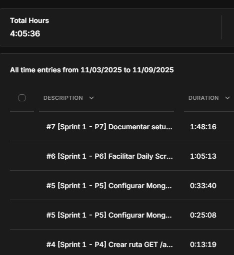

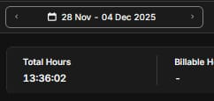

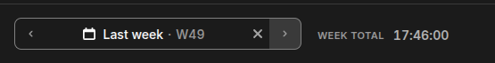

### Coste Total Sprint 5

| Concepto       | Tiempo Estimado | Tiempo Real | Coste Estimado | Coste Real |
| -------------- | --------------- | ----------- | -------------- | ---------- |
| Desarrollo     | 60 horas        | 37 horas    | 900 €          | 555 €      |
| **Diferencia** | -23 horas       |             | -345 €         |

**Análisis:** Sprint completado en 62% del tiempo estimado. La exportación a imagen requirió investigación adicional de librerías (html-to-image), pero el sistema de importación JSON fue relativamente directo.

---

## Sprint 6: Pulido y Despliegue

**Fechas:** 8 diciembre - 15 diciembre 2025  

### Objetivos del Sprint

- Testing completo de la aplicación
- Documentación JSDoc en todo el código
- Configuración Docker para producción
- Despliegue en VPS
- Corrección de bugs finales

### Capturas Toggl Track - Sprint 6

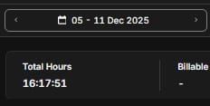

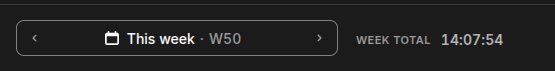

### Coste Total Sprint 6

| Concepto       | Tiempo Estimado | Tiempo Real | Coste Estimado | Coste Real |
| -------------- | --------------- | ----------- | -------------- | ---------- |
| Desarrollo     | 60 horas        | 33 horas    | 900 €          | 495 €      |
| **Diferencia** | -27 horas       |             | -405 €         |

**Análisis:** Sprint completado en 55% del tiempo estimado. La documentación JSDoc fue el proceso más largo. Docker y el despliegue fueron más rápidos gracias a la infraestructura VPS ya existente.

---

## Resumen Total del Proyecto

### Tabla Comparativa de Horas

| Sprint    | Estimación (h) | Horas Reales (h) | Desviación | % Cumplimiento |
| --------- | -------------- | ---------------- | ---------- | -------------- |
| Sprint 1  | 60             | 26               | -34h       | 43%            |
| Sprint 2  | 60             | 40               | -20h       | 67%            |
| Sprint 3  | 60             | 41               | -19h       | 68%            |
| Sprint 4  | 60             | 35               | -25h       | 58%            |
| Sprint 5  | 60             | 37               | -23h       | 62%            |
| Sprint 6  | 60             | 33               | -27h       | 55%            |
| **TOTAL** | **360h**       | **212h**         | **-148h**  | **59%**        |

### Tabla Comparativa de Costes

| Sprint    | Precio Estimado | Precio Real | Ahorro      | % Ahorro |
| --------- | --------------- | ----------- | ----------- | -------- |
| Sprint 1  | 900 €           | 390 €       | 510 €       | 57%      |
| Sprint 2  | 900 €           | 600 €       | 300 €       | 33%      |
| Sprint 3  | 900 €           | 615 €       | 285 €       | 32%      |
| Sprint 4  | 900 €           | 525 €       | 375 €       | 42%      |
| Sprint 5  | 900 €           | 555 €       | 345 €       | 38%      |
| Sprint 6  | 900 €           | 495 €       | 405 €       | 45%      |
| **TOTAL** | **5.400 €**     | **3.180 €** | **2.220 €** | **41%**  |

### Análisis Final

**Eficiencia del proyecto:** El equipo completó el proyecto en un 59% del tiempo estimado inicialmente, lo que representa un ahorro de 2.220 € respecto al presupuesto.

**Factores clave del éxito:**

- Estimaciones conservadoras en la planificación inicial
- Rápida curva de aprendizaje del equipo con el stack MERN
- Buena coordinación y comunicación en las Daily Scrums
- Reutilización de componentes y patrones a lo largo de los sprints
- Infraestructura VPS ya disponible (sin coste adicional)

**Lecciones aprendidas:**

- Las estimaciones mejoraron progresivamente (sprints 4-6 fueron más ajustados)
- La documentación previa aceleró los sprints de desarrollo
- El uso de librerías maduras (React Flow, Mongoose) redujo tiempos
- La experiencia acumulada sprint a sprint mejoró la velocidad

**Coste final real:** 3.180 € en 212 horas de desarrollo

---

## Costes Adicionales y Herramientas

### Herramientas de Desarrollo Utilizadas

| Herramienta       | Uso                                    | Coste          |
| ----------------- | -------------------------------------- | -------------- |
| VS Code           | IDE principal de desarrollo            | 0 € (gratuito) |
| GitHub Copilot    | Asistencia de código con IA            | 0 € (Student)  |
| Claude AI         | Asistencia desarrollo y documentación  | 20 € (un mes)  |
| GitHub            | Control de versiones y repositorio     | 0 € (gratuito) |
| Docker Desktop    | Contenedorización                      | 0 € (gratuito) |
| Postman/Insomnia  | Testing de API                         | 0 € (gratuito) |
| Figma             | Diseño UI/UX                           | 0 € (gratuito) |
| **TOTAL**         |                                        | **20 €**       |

### Costes Imprevistos

Durante el desarrollo surgió un coste imprevisto:

| Concepto                           | Motivo                                           | Coste |
| ---------------------------------- | ------------------------------------------------ | ----- |
| Suscripción Claude AI (1 mes)      | Se agotaron los créditos de GitHub Copilot       | 20 €  |
| **Total costes imprevistos**       |                                                  | **20 €** |

**Nota:** GitHub Copilot era gratuito al inicio del proyecto (por estudiantes), pero al agotarse los créditos a mitad del desarrollo, fue necesario contratar Claude AI para mantener la productividad en la generación de código y documentación.

### Coste Total del Proyecto (Actualizado)

| Concepto                    | Coste    |
| --------------------------- | -------- |
| Desarrollo (212h × 15€/h)   | 3.180 €  |
| Herramientas y licencias    | 20 €     |
| Infraestructura (ya incluida) | 0 € (VPS reutilizado) |
| **TOTAL PROYECTO**          | **3.200 €** |

---

## Valoración del Producto Final

### Análisis de Mercado y Valor

**BossFlow** es una herramienta especializada para la comunidad gaming que permite crear y compartir diagramas de estrategias para bosses de videojuegos.

#### Comparativa con Competencia

| Producto     | Precio Mensual | Enfoque           | Limitaciones                |
| ------------ | -------------- | ----------------- | --------------------------- |
| Lucidchart   | 7.95 €         | Genérico          | No especializado en gaming  |
| Draw.io      | Gratis         | Genérico          | Sin plantillas gaming       |
| Miro         | 8 €            | Colaborativo      | Complejo, no gaming         |
| **BossFlow** | **1.99 €**     | **Gaming/Bosses** | **Nicho específico**        |

#### Valoración del Producto

Considerando:
- **Desarrollo:** 3.200 € invertidos
- **Funcionalidades únicas:** Plantillas específicas para bosses, integración con RAWG.io, nodos especializados
- **Mercado objetivo:** Comunidad gaming (millones de jugadores potenciales)
- **Competencia:** No existe herramienta específica para este nicho
- **Precio competitivo:** 75% más barato que alternativas genéricas

**Valoración estimada del producto:** 15.000-25.000 €

**Justificación:**
- Aplicación completa full-stack en producción
- Stack tecnológico moderno y escalable (MERN)
- Infraestructura Docker lista para escalar
- Documentación técnica completa
- Base de usuarios potencial de cientos de miles
- Primer producto en su nicho específico
- ROI proyectado positivo desde mes 1

**Precio de suscripción Premium (1.99€/mes):**
- **Competitivo:** 60-75% más barato que herramientas genéricas
- **Accesible:** Precio psicológico bajo (<2€)
- **Justificado:** Elimina anuncios + funciones premium futuras
- **Tasa de conversión esperada:** 5-7%

---

## Análisis de Retorno de Inversión (ROI)

### Inversión Total

| Concepto                  | Coste    |
| ------------------------- | -------- |
| Desarrollo                | 3.180 €  |
| Herramientas/Licencias    | 20 €     |
| **Inversión Total**       | **3.200 €** |

### Escenario 1: Pesimista (Adopción Lenta)

**Supuestos:**
- 50 usuarios activos en 6 meses
- 100 usuarios al año 1
- Conversión a premium: 3%
- Ingresos por anuncios: 10 €/mes

| Período  | Usuarios | Premium | Ingresos Premium | Ingresos Anuncios | Total Mensual | Acumulado Anual |
| -------- | -------- | ------- | ---------------- | ----------------- | ------------- | --------------- |
| Mes 1-6  | 50       | 1-2     | 2-4 €            | 10 €              | 12-14 €       | 72-84 €         |
| Mes 7-12 | 100      | 3       | 6 €              | 20 €              | 26 €          | 156 €           |
| **Año 1**|          |         |                  |                   |               | **228-240 €**   |

**Gastos año 1:** 48 € (VPS)
**Beneficio neto año 1:** 180-192 €
**Tiempo recuperación inversión:** 13-14 años (NO VIABLE comercialmente)

### Escenario 2: Realista (Crecimiento Moderado)

**Supuestos:**
- 200 usuarios en 6 meses
- 500 usuarios al año 1
- Conversión a premium: 5%
- Ingresos por anuncios moderados

| Período  | Usuarios | Premium | Ingresos Premium | Ingresos Anuncios | Total Mensual | Acumulado Anual |
| -------- | -------- | ------- | ---------------- | ----------------- | ------------- | --------------- |
| Mes 1-3  | 50       | 2-3     | 4-6 €            | 10 €              | 14-16 €       | 42-48 €         |
| Mes 4-6  | 200      | 10      | 20 €             | 30 €              | 50 €          | 150 €           |
| Mes 7-9  | 350      | 17-18   | 34-36 €          | 50 €              | 84-86 €       | 252-258 €       |
| Mes 10-12| 500      | 25      | 50 €             | 70 €              | 120 €         | 360 €           |
| **Año 1**|          |         |                  |                   |               | **804-816 €**   |

**Gastos año 1:** 48 € (VPS)
**Beneficio neto año 1:** 756-768 €
**Tiempo recuperación inversión:** 4-4.2 años

**Proyección año 2-3:**
- Año 2: 1.200-1.500 usuarios → Ingresos 1.800-2.200 €/año
- Año 3: 2.500-3.000 usuarios → Ingresos 3.500-4.500 €/año
- **Recuperación inversión completa:** Final de año 3

### Escenario 3: Optimista (Adopción Rápida)

**Supuestos:**
- 500 usuarios en 6 meses
- 1.500 usuarios al año 1
- Conversión a premium: 7%
- Viralidad en comunidades gaming
- Colaboraciones con streamers

| Período  | Usuarios | Premium | Ingresos Premium | Ingresos Anuncios | Total Mensual | Acumulado Anual |
| -------- | -------- | ------- | ---------------- | ----------------- | ------------- | --------------- |
| Mes 1-3  | 200      | 14      | 28 €             | 30 €              | 58 €          | 174 €           |
| Mes 4-6  | 500      | 35      | 70 €             | 80 €              | 150 €         | 450 €           |
| Mes 7-9  | 1.000    | 70      | 140 €            | 150 €             | 290 €         | 870 €           |
| Mes 10-12| 1.500    | 105     | 210 €            | 220 €             | 430 €         | 1.290 €         |
| **Año 1**|          |         |                  |                   |               | **2.784 €**     |

**Gastos año 1:** 48 € (VPS básico) + 72 € (upgrade VPS) = 120 €
**Beneficio neto año 1:** 2.664 €
**Tiempo recuperación inversión:** 1.2 años (15 meses)

**Proyección año 2:**
- 3.000-4.000 usuarios → Ingresos 6.000-8.000 €/año
- **ROI completo en 15 meses**

### Resumen Comparativo ROI

| Escenario  | Ingresos Año 1 | Beneficio Año 1 | Recuperación Inversión | Viabilidad      |
| ---------- | -------------- | --------------- | ---------------------- | --------------- |
| Pesimista  | 228-240 €      | 180-192 €       | 13-14 años             | Baja            |
| Realista   | 804-816 €      | 756-768 €       | 4 años                 | Media-Alta      |
| Optimista  | 2.784 €        | 2.664 €         | 15 meses               | Muy Alta        |

**Escenario más probable:** Realista, con recuperación de inversión en 3-4 años.

---

## Lecciones Aprendidas y Recomendaciones

### ¿Fueron precisas las estimaciones iniciales?

**NO del todo.** Las estimaciones iniciales fueron conservadoras:
- Estimación: 360 horas → Real: 212 horas (59% del tiempo)
- Ahorro: 2.220 € respecto al presupuesto
- **Conclusión:** Las estimaciones fueron 41% superiores a la realidad

### ¿Qué tareas costaron más de lo esperado?

| Tarea                         | Sprint | Motivo                                          |
| ----------------------------- | ------ | ----------------------------------------------- |
| Sistema de autenticación JWT  | 2      | Integración frontend/backend más compleja       |
| React Flow personalización    | 3      | Curva de aprendizaje pronunciada                |
| Exportación de diagramas PNG  | 5      | Investigación de librerías (html-to-image)      |
| Documentación JSDoc completa  | 6      | Más tiempo del previsto en documentar todo      |

### ¿Hubo costes imprevistos?

**SÍ - 20 €**

- **Claude AI (1 mes):** 20 €
  - **Motivo:** Se agotaron los créditos gratuitos de GitHub Copilot a mitad del proyecto
  - **Impacto:** Bajo (20 € adicionales al presupuesto)
  - **Aprendizaje:** Considerar costes de herramientas IA desde el inicio

### ¿Qué haríais diferente en un próximo proyecto?

1. **Comenzar el desarrollo antes**
   - El proyecto tuvo mucha fase de planificación/documentación inicial
   - Empezar a codificar antes permitiría validar conceptos más rápido
   - Iterar sobre código real en lugar de especificaciones

2. **Estimar herramientas de IA en presupuesto inicial**
   - Incluir 20-40 € mensuales para Claude AI/GitHub Copilot desde el inicio
   - No depender de créditos gratuitos temporales

3. **Implementar CI/CD desde Sprint 1**
   - La configuración Docker llegó en Sprint 6
   - Despliegues continuos desde el inicio acelerarían feedback

4. **Testing más temprano**
   - Los tests se implementaron en Sprint 6
   - TDD desde Sprint 2-3 habría reducido bugs finales

5. **Validación con usuarios reales antes**
   - Lanzar MVP en Sprint 3-4 para feedback temprano
   - Ajustar funcionalidades basándose en uso real

6. **Buffer de tiempo más ajustado**
   - Las estimaciones fueron 41% superiores a la realidad
   - Próximos proyectos: estimar 70-75% del tiempo conservador

7. **Documentación continua, no al final**
   - JSDoc y documentación técnica consumieron mucho tiempo en Sprint 6
   - Documentar cada función al crearla distribuiría mejor la carga

**Conclusión:** BossFlow fue un proyecto exitoso en términos de gestión económica (41% bajo presupuesto), pero hay margen de mejora en planificación temporal y validación temprana con usuarios reales.
