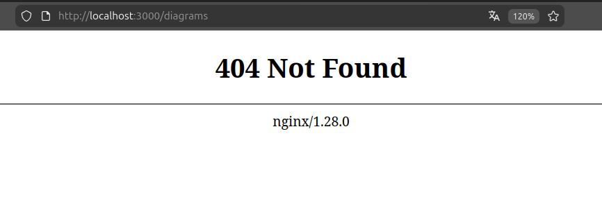

# Documentación de la validación del sprint 2

## Testing manual de registro

Se ha testeado manualmente el registro y funciona correctamente

## Testing manual de login

Se ha testeado manualmente el login y funciona correctamente

## X Persistencia de sesión

La persistencia de la sesión funciona. Pero, el problema es que siempre se guarda la sesión, aunque no le des a "recordarme".

## Rutas protegidas

Las rutas protegidas funcionan y te redirige a login cuando no hay sesión correctamente. Pendiente: mostrar un mensaje informativo en la página de login indicando que es necesario iniciar sesión para acceder a la página solicitada.

## Bugs encontrados

El único bug encontrado (además de la persistencia de sesión) es que al recargar cualquier página que no sea la de inicio, salta un error 404. 
